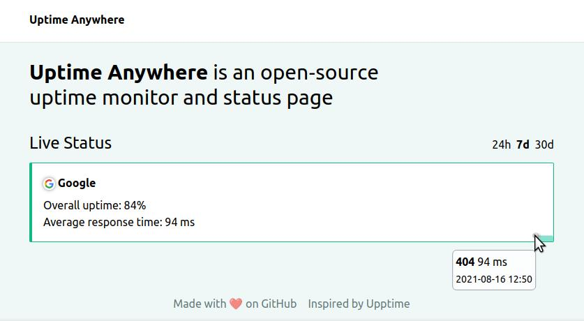

# Uptime Anywhere

A lighter version of [upptime](https://upptime.js.org/) that can run anywhere!

## Get Started

**If you want to host it on GitHub**

1. Click the link below to generate your own repo from a template

   

2. Setup pages
3. Add your websites to `monitor/public/data/config.json`
4. Enjoy :tea:

**If you want to host it on GitLab**

1. Go to the [Releases](https://github.com/lil5/uptime-anywhere/releases/)
2. Download the latest `Source code (zip)`
3. Open `website/src/index.html` and comment line 35
4. Unzip then create a git repository inside
5. Push to GitLab
6. Create a _Schedule_ (**CI** -> **Schedules** -> **New schedule**)
7. Setup _Pages_ (**Settings** -> **Pages**)
8. Add your websites to `monitor/public/data/config.json`

## Development

Open [**DEVELOPMENT.md**](DEVELOPMENT.md) for some steps and explanations.
